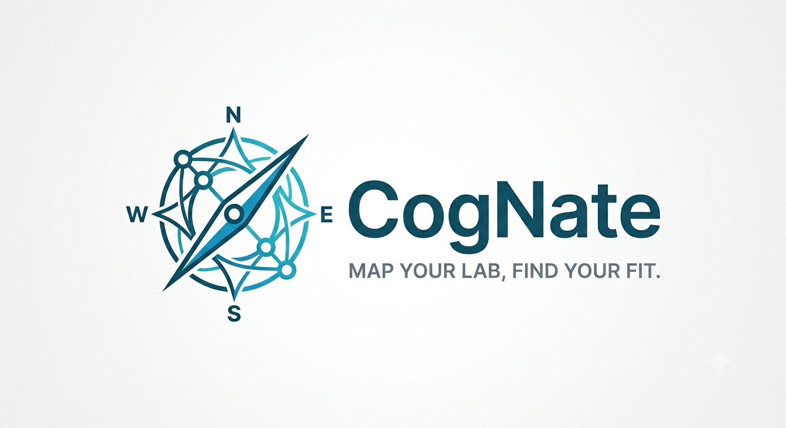
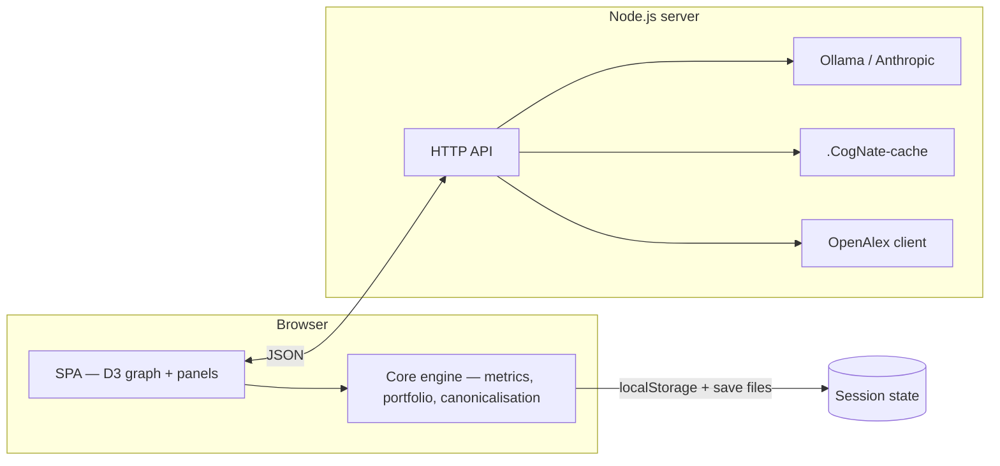

# CogNate


**Map the labs you are considering, then find where you actually fit.**

CogNate is a local-first research career tool. You add labs you might join, build a profile from your CV or publication record, and get an interactive map that scores each lab on shared ground, what you would uniquely contribute, what you would learn, and whether the work aligns with where you want to go next.

Everything runs on your machine. Lab and profile extraction uses a local LLM through [Ollama](https://ollama.com/) by default. Your data never leaves your computer unless you choose to call an external API or OpenAlex for publication lookup.

---

## Why CogNate exists

Choosing a lab is usually done with gut feel and pairwise comparison: read a few websites, compare yourself to one group at a time, and hope the overlap you noticed is the overlap that matters.

That misses three things a network can see:

1. **Scarcity** — a skill that 12 of 15 labs already have is table stakes, not leverage. Only a map of many labs knows which of your strengths are actually rare.
2. **Intent vs. history** — a broad publication record makes every lab look plausible. CogNate separates what you have done from what you want to do next.
3. **Portfolio risk** — the top five labs on a ranked list are often near-duplicates. CogNate builds a diversified shortlist, not just a sorted list.

---

## Features

- **Interactive lab map** — force-directed graph of labs, topics, and your profile, built with D3
- **LLM-powered extraction** — turns lab descriptions, PDFs, and CVs into comparable topic vectors
- **Shared vocabulary** — canonicalises synonyms so the graph actually connects
- **Multi-axis fit scoring** — Foundation, Leverage, Growth, Direction, and Transfer, with explicit risk flags
- **Portfolio shortlist** — maximal marginal relevance to avoid five applications to the same niche
- **OpenAlex integration** — look up authors by name or ORCID, import publications, discover similar PIs
- **Field-aware setup** — generate a vocabulary for your discipline, or start from a life-sciences starter pack
- **Portable saves** — export and import full session state as JSON
- **Fast mode** — shorter excerpts and no evidence strings for roughly 2× speed on slow hardware

---


https://github.com/user-attachments/assets/9d151783-2e25-450b-9529-f3295f80ca8d


---
## Quick start

### Prerequisites

| Requirement | Notes |
|-------------|-------|
| **Node.js ≥ 20** | [nodejs.org](https://nodejs.org/) |
| **Ollama** | [ollama.com](https://ollama.com/) — local LLM runtime |
| **A capable model** | Default: `qwen2.5-coder:14b` (~9 GB). Smaller models work but produce noisier topic labels. |

### Install and run

```bash
git clone https://github.com/YOUR_USERNAME/CogNate.git
cd CogNate
npm install
npm run build
npm run dev
```

Open **http://localhost:7800** in your browser.

Pull the default model before first use:

```bash
ollama pull qwen2.5-coder:14b
ollama serve   # if Ollama is not already running
```

### Typical workflow

1. **Set your field** — describe your area or pick the life-sciences starter pack. CogNate builds a shared topic vocabulary.
2. **Add labs** — enter a PI name, institution, and research description. Optionally attach `.pdf`, `.md`, or `.txt` files.
3. **Build your profile** — upload a CV, or look yourself up via OpenAlex (name or ORCID) and import your publications.
4. **State your direction** — say where you want to go next. This is scored separately from your track record.
5. **Explore the map** — click labs and topics, inspect fit breakdowns, and review the diversified application shortlist.

---

## Architecture

CogNate is a single Node.js server that serves a static SPA and exposes a small JSON API. All scoring and graph logic runs in the browser; the server handles LLM calls, caching, and OpenAlex requests.



### Repository layout

```
├── public/              Static UI (HTML, CSS, bundled app.js, PDF worker)
├── src/
│   ├── client/          Browser app — graph, panels, API client, PDF parsing
│   ├── core/            Pure TypeScript — scoring, portfolio, canonicalisation, types
│   └── server/          HTTP server — LLM provider, prompts, OpenAlex, cache
├── scripts/             Build helpers
└── dist/                Compiled server output (generated)
```

---

## Data model

CogNate does not use a traditional database. Session state lives in the browser and can be exported to a portable JSON file.

### Session state (`State`)

| Field | Description |
|-------|-------------|
| `labs` | Analysed research groups with topic vectors, summaries, and source metadata |
| `vocab` | Shared canonical topic labels accumulated across labs and your profile |
| `me` | Your profile — topics, assets, aspirations, and provenance |
| `field` | Field configuration — description, keywords, generated vocabulary, starter pack ID |

### Topic

Each lab and profile is represented as a sparse vector over shared topic labels:

```json
{
  "label": "diffusion models",
  "category": "method",
  "weight": 0.85,
  "detail": "ensemble-conditioned structural design of peptide for antibody escape",
  "recency": "emerging",
  "pursuit": 1.0,
  "evidence": "Last three papers use diffusion models on HA/NA"
}
```

| Field | Role |
|-------|------|
| `label` | Canonical subject heading used in all comparisons |
| `category` | `system`, `method`, `theory`, or `application` |
| `weight` | Centrality to the lab's programme, or demonstrated depth for a person |
| `detail` | Lab-specific phrasing — shown in the UI, not used in scoring |
| `recency` | `emerging`, `core`, or `legacy` — inferred, least reliable field |
| `pursuit` | For profiles only: how much you still want to do this (0–1) |
| `evidence` | Source snippet — display only, omitted in fast mode |

### Save file format

Exported saves use a versioned envelope:

```json
{
  "format": "CogNate",
  "version": 1,
  "savedAt": "2026-08-09T08:00:00.000Z",
  "state": { "labs": [], "vocab": [], "me": null, "field": null },
  "settings": {
    "threshold": 0.12,
    "spread": 1.0,
    "lambda": 0.65,
    "portfolioK": 5,
    "weights": { "foundation": 0.32, "leverage": 0.28, "growth": 0.16, "direction": 0.24 }
  }
}
```

### Server-side cache

LLM responses are cached under `.CogNate-cache/` keyed by model, prompt, and mode. Re-analysing unchanged material is instant. Safe to delete at any time.

---

## How fit is scored

Every lab and your profile become weighted vectors over one shared vocabulary. Similarity is a weighted cosine over shared labels.

| Metric | Meaning |
|--------|---------|
| **Foundation** | Shared ground — weighted by `pursuit` so past work you have moved on from counts less |
| **Leverage** | Your scarce topics the lab lacks, weighted by inverse document frequency across the network. Gated by Foundation — you cannot score high on leverage with zero credibility |
| **Growth** | Their topics you have not worked in — what you would learn |
| **Direction** | Share of the lab's programme aligned with your stated aspirations. Null (and its weight dropped) when you have not stated a direction |
| **Transfer** | For pivots: geometric mean of portable methods you carry and new systems/applications you would enter |

**Overall score** is a weighted combination of the above. Default weights: Foundation 32%, Leverage 28%, Growth 16%, Direction 24%.

**Risk flags** include `thin-foundation`, `redundant`, `nothing-to-learn`, `isolated`, `declining`, `off-direction`, `no-bridge`, and `past-self`.

**Portfolio shortlist** uses maximal marginal relevance:

```
λ × quality − (1 − λ) × redundancy-with-already-picked
```

Default λ = 0.65. Lower values favour diversification over raw fit.

The **View** panel in the app shows the full formulas and lets you tune threshold, spread, and portfolio parameters.

---

## Configuration

### npm scripts

| Command | Description |
|---------|-------------|
| `npm run build` | Compile server TypeScript and bundle the client |
| `npm run dev` | Build and start the server |
| `npm start` | Start the server (requires prior build) |
| `npm run fast` | Start with fast mode enabled |
| `npm test` | Run core unit tests |
| `npm run bench` | Benchmark LLM models on lab extraction quality |
| `npm run typecheck` | Type-check without emitting |

### Server CLI flags

```bash
node dist/server/index.js [options]

  --port 7800              HTTP port (default: 7800)
  --model qwen2.5-coder:14b
  --ollama http://localhost:11434
  --ctx 8192                 Context window size
  --keep-alive 30m           Ollama model keep-alive (prevents reload stalls)
  --concurrency 3            Parallel lab analyses
  --fast                     Shorter excerpts, no evidence strings
  --anthropic                Use Anthropic API (requires ANTHROPIC_API_KEY)
  --mailto you@example.com   OpenAlex polite pool (recommended)
```

### Environment variables

| Variable | Description |
|----------|-------------|
| `ANTHROPIC_API_KEY` | Enables Claude as an optional provider (`--anthropic`) |
| `OPENALEX_MAILTO` | Your email for OpenAlex's faster rate-limit pool |

### Ollama tuning

For batch lab analysis, set parallel requests in Ollama to at least the server concurrency:

```bash
OLLAMA_NUM_PARALLEL=3 ollama serve
```

If the tool feels inconsistently slow after idle periods, increase `--keep-alive` — Ollama unloads models after 5 minutes by default.

### Model selection

The default model balances quality and speed on a typical laptop GPU. To compare models on your hardware:

```bash
npm run build && npm run bench
npm run bench -- --models qwen2.5-coder:14b qwen2.5:7b llama3.1:8b
```

The benchmark reports vocabulary reuse (synonyms fragment the graph) and generic-topic rate (over-tagging makes every lab look the same).

---

## API reference

All endpoints are served from `http://127.0.0.1:7800`. The server binds to localhost only.

| Method | Path | Description |
|--------|------|-------------|
| `GET` | `/api/config` | Current model, provider, and Ollama status |
| `POST` | `/api/config` | Update model, provider, or fast mode |
| `POST` | `/api/field` | Generate a field vocabulary from description + keywords |
| `GET` | `/api/packs` | List built-in starter vocabulary packs |
| `POST` | `/api/lab` | Analyse one lab |
| `POST` | `/api/labs` | Batch analyse labs (Server-Sent Events stream) |
| `POST` | `/api/cv` | Analyse a CV text |
| `POST` | `/api/works` | Build a profile from OpenAlex publications |
| `POST` | `/api/aspiration` | Parse a free-text career intent into topic weights |
| `POST` | `/api/authors` | Search OpenAlex by name, ORCID, or OpenAlex ID |
| `POST` | `/api/publications` | Fetch recent works for an author |
| `POST` | `/api/discover` | Suggest PIs publishing on your map's topics |
| `POST` | `/api/brief` | Generate a short career advice brief for a lab fit |

---

## Development

```bash
# Install dependencies
npm install

# Type-check
npm run typecheck

# Run tests (core scoring logic)
npm test

# Build everything
npm run build

# Start server
npm start
```

### Core module

`src/core/` is pure TypeScript with no I/O dependencies. It contains:

- **canonical.ts** — synonym snapping and vocabulary maintenance
- **metrics.ts** — similarity, scarcity, fit scoring, network metrics
- **portfolio.ts** — maximal marginal relevance shortlist
- **seed.ts** — life-sciences starter vocabulary
- **types.ts** — shared type definitions

This module is tested independently (`src/core/metrics.test.ts`) and can be reused or extended without the UI.

---

## Privacy and data handling

- **Local by default** — lab descriptions, CVs, and PDFs are sent only to your local Ollama instance
- **No accounts** — no sign-up, no telemetry, no cloud storage
- **OpenAlex is optional** — used only when you search for authors or discover labs; queries go to `api.openalex.org`
- **Anthropic is optional** — only when you explicitly enable `--anthropic` and set `ANTHROPIC_API_KEY`
- **Browser storage** — session state persists in `localStorage`; clear it by wiping site data or using **Clear all labs**

---

## Limitations

- **LLM quality matters** — small or poorly instruction-tuned models produce fragmented vocabularies and generic topics. The graph will look connected but be wrong.
- **Last-authorship heuristic** — OpenAlex lab discovery assumes the last author runs the lab. This holds in most biology and medicine; it fails in fields with alphabetical or contribution-based author order.
- **PDF scans** — image-only PDFs have no extractable text. Export a text-based PDF or paste content manually.
- **Google Scholar** — no API and active anti-scraping; use ORCID or OpenAlex instead.
- **English-first** — prompts and starter vocabulary are English. Other languages may work with a multilingual model but are not tested.

---

## Contributing

Contributions are welcome. Useful areas:

- Starter vocabulary packs for additional fields (physics, chemistry, CS, economics)
- Prompt improvements for better topic grain on smaller models
- UI accessibility and mobile layout
- Additional profile sources (Semantic Scholar, DBLP)

Please open an issue before large architectural changes.

---

## License

Apache License 2.0 — see [LICENSE](LICENSE).

---

## Acknowledgements

- [Ollama](https://ollama.com/) for local LLM inference
- [OpenAlex](https://openalex.org/) for open bibliographic data
- [D3](https://d3js.org/) for the force-directed graph
- [PDF.js](https://mozilla.github.io/pdf.js/) for client-side PDF text extraction
